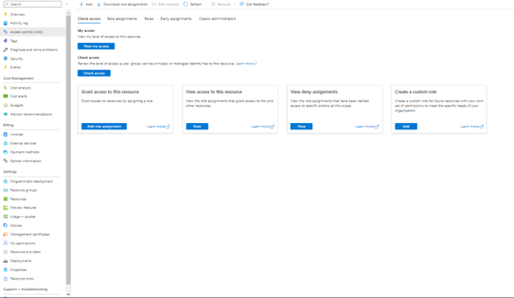
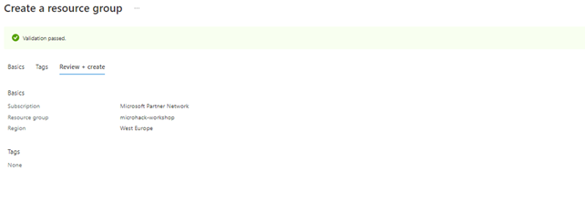
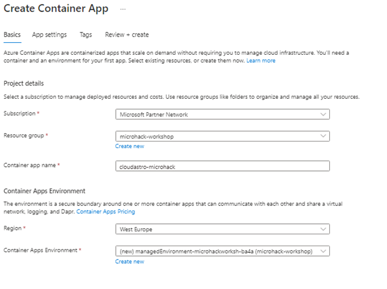
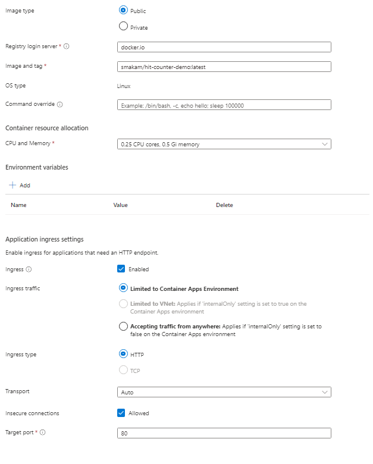
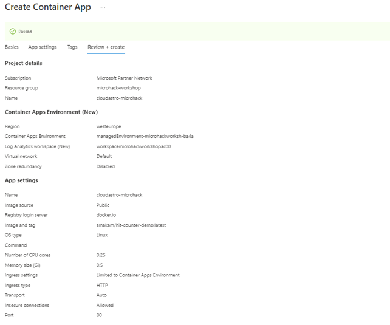
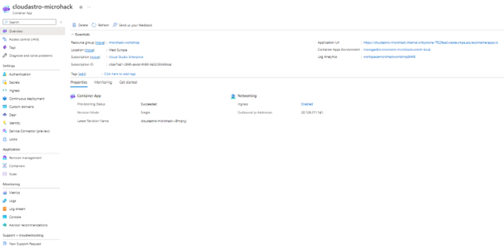

# **02 Moving a containerised app to PaaS/serverless**

## **Introduction**

The workshop provided by us aims towards providing Container App resource on Azure with test “hello world” docker image from internet.

Workshop consists of the deployment and presenting how serverless resources on Azure provides functionalization of the application without need to deploy it on multiple container orchestrator tools such as: Kubernetes cluster, docker swarm.

In this case we deployed only a simple application in one docker image to the container app and provide link to show the container runs automatically without prerequisites.

## **Requirements**

Application deployment can be done successfully after receiving full control on Docker image repo credentials of the client.

### **Infrastructure Environment:**

- Subscription to deploy resources
- Container App resource in Azure
- Docker image link user/password to add in resource

## **Reference links**

Microsoft - [https://learn.microsoft.com/en-us/azure/container-apps/quickstart-portal](https://learn.microsoft.com/en-us/azure/container-apps/quickstart-portal)

Microsoft Video - [https://www.youtube.com/watch?v=b3dopSTnSRg](https://www.youtube.com/watch?v=b3dopSTnSRg)

[Back to top](#02-moving-a-containerised-app-to-paasserverless)

## **Challenges**

Goal
Main goals to achieve in this workshop:

1. Participating and working as a team with colleagues
2. Deploying docker image sample from internet in container app
3. Discussion with colleagues about benefits of serverless resources

Actions
Actions that we took to achieve goals:

1. [Find docker image sample from internet](#find-docker-image-sample-from-internet)
2. [Assign permissions to users joined in that tenant](#assign-permissions-to-users-joined-in-that-tenant)
3. [Create resource group](#create-resource-group)
4. [Create Azure Container App in Subscription and resource group that we created](#create-azure-container-app-in-subscription-and-resource-group-that-we-created)
5. [Configure Container App with image we found in internet](#configure-container-app-with-image-we-found-in-internet)
6. [Deploying demo container with link the resource provided to us](#deploying-demo-container-with-link-the-resource-provided-to-us)

## **Find docker image sample from internet**

[Back to top](#02-moving-a-containerised-app-to-paasserverless)

## **Assign permissions to users joined in that tenant**

Steps in screenshots:

1. Role assignment to subscription

[Back to top](#02-moving-a-containerised-app-to-paasserverless)

## **Create resource group**

2. Creating resource group

[Back to top](#02-moving-a-containerised-app-to-paasserverless)

## **Create Azure Container App in Subscription and resource group that we created**

3. Create Container App in Subscription and resource group

[Back to top](#02-moving-a-containerised-app-to-paasserverless)

## **Configure Container App with image we found in internet**

4. Configuration of Container App with image we found in internet (ingress needed to port 80 for showing success results)

[Back to top](#02-moving-a-containerised-app-to-paasserverless)

## **Deploying demo container with link the resource provided to us**

5. Validation passed

6. Container App resource in Azure created successfully

[Back to top](#02-moving-a-containerised-app-to-paasserverless)

## **Evaluation**

Overview

1. Why use Azure serverless “Container App” resource?
  Azure Container App helps deploying that less useable part of web application to be used whenever it’s needed to use.

2. What is that part of application that is recommended to run in “Container App” resource?
  Azure Container App it’s recommended to be used for deploying parts like:

- Deploying API endpoints
- Hosting background processing applications
- Handling event-driven processing
- Running microservices
  
  Recommended from Microsoft check: [https://learn.microsoft.com/en-us/azure/container-apps/overview](https://learn.microsoft.com/en-us/azure/container-apps/overview)

Benefits

- HTTP traffic
- Event-driven processing
- CPU or memory load
- Any KEDA-supported scaler
- Priceless
- Container runs with no requirements, simple and easy (create image and run it automatically no requirement)

Recommended from Microsoft check: [https://learn.microsoft.com/en-us/azure/container-apps/overview](https://learn.microsoft.com/en-us/azure/container-apps/overview)
